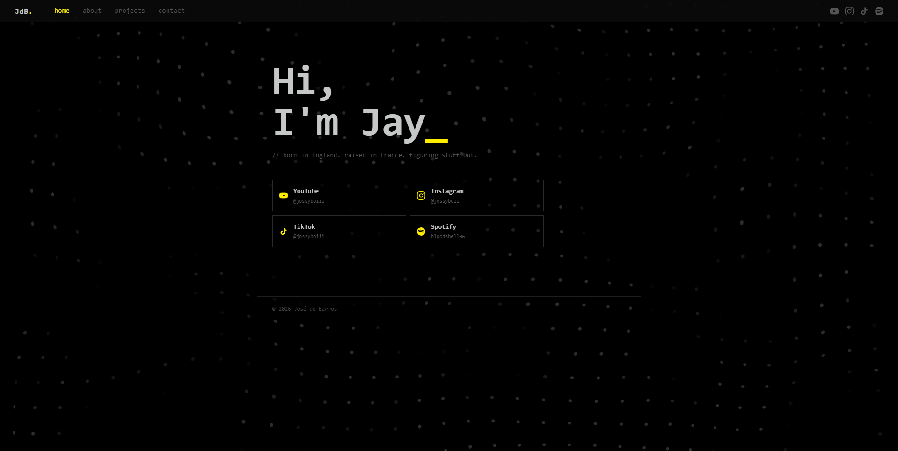

# jossyboiii.me — Personal Portfolio
 

 
Personal portfolio and social hub. Doubles as a Linktree replacement and a professional landing page.
 
Built with vanilla HTML, CSS, and JavaScript — no frameworks, no dependencies.
 
---
 
## Features
 
- Tab-based navigation with fade transitions
- Background video with dark overlay
- Social hub with cards for YouTube, Instagram, TikTok, and Spotify
- Experience and education timeline
- Projects section with featured project, category filters, and auto-cycling screenshots
- Keyboard navigation (← →)
- Fully responsive — mobile hamburger menu included
